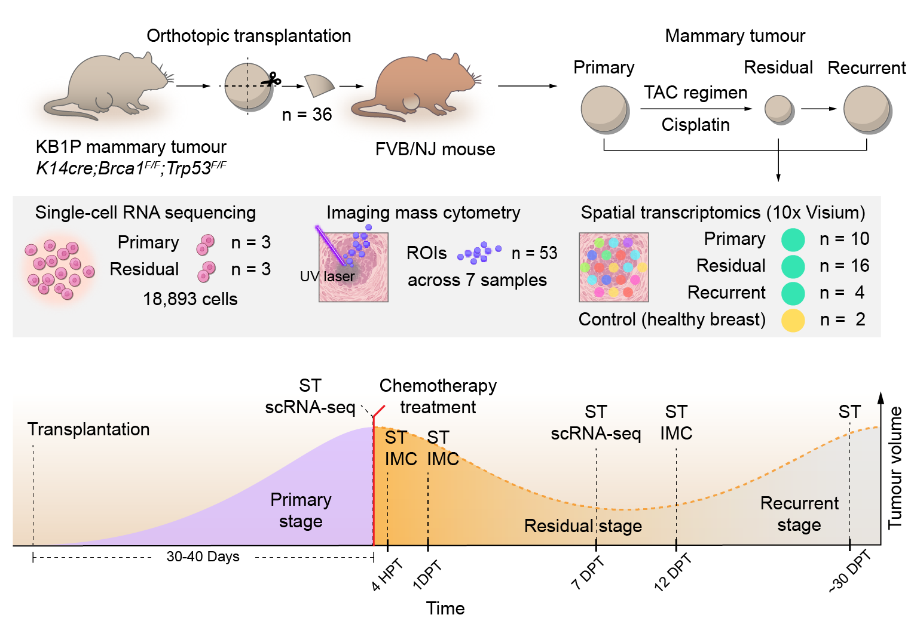

# Spatiotemporal organisation of residual disease in mouse and human BRCA1-deficient mammary tumours and breast cancer 

This repository contains scripts and notebooks used to analyse spatial transcriptomics, imaging mass cytometry, 
and single-cell RNA sequencing data presented in our research article. To rerun the analysis, you'll need to take some 
extra steps, such as getting the raw data, adjusting directory paths, and downloading raw and processed supplementary 
files from the Zenodo archives (ST: [15102983](https://doi.org/10.5281/zenodo.15102983), scRNA-seq: 
[15103411](https://doi.org/10.5281/zenodo.15103411), IMC co-registered with Visium: 
[15096025](https://doi.org/10.5281/zenodo.15096025)).

**Authors**: Demeter Túrós, Morgane Decollogny, Anna Moyseos, Astrid Chanfon, Myriam Siffert, Joanne Bousmar, 
Lou Romanens, Jean-Christophe Tille, Intidhar Labidi-Galy, Alberto Valdeolivas, and Sven Rottenberg

**Abstract**: Breast cancer remains a leading cause of death worldwide. Although chemotherapy  reduces primary and 
metastatic tumour burden, persisting drug-tolerant tumour cell populations, known as minimal residual disease (MRD), 
pose a significant risk of recurrence and therapy resistance. In this study, we describe the spatiotemporal organisation
of therapy response and MRD in BRCA1;p53-deficient mouse mammary tumours and human clinical samples. By integrating 
single-cell RNA sequencing, spatial transcriptomics, and imaging mass cytometry across multiple treatment timepoints, we
characterise dynamic interactions between tumour cell subpopulations and their surrounding microenvironment. Our 
multiomic analysis uncovers a distinct, chemotherapy-tolerant epithelial-mesenchymal transition (EMT) cancer cell 
population that displays a conserved expression programme in human BRCA1-deficient tumours, significantly correlates 
with adverse clinical outcomes, and can be pharmacologically targeted in preclinical models. We reveal the spatial 
distribution of residual EMT-like tumour cells within discrete anatomical niches, providing a framework for 
understanding the persistence of MRD and potential therapeutic vulnerabilities. 

<p align="center">
   
</p>

## Structure
```
.
├── imc
│   ├── spatialdata_imc
│   └── spatialdata_visium
│       └── functional_analysis
├── misc
├── organoids
├── single_cell
└── spatial_transcriptomics
    ├── human_data
    │   ├── dgea
    │   ├── emt_prolif_signatures
    │   ├── survival_analysis
    │   └── tumor_purity
    └── mouse_data
        ├── deconvolution_notebooks
        ├── dgea
        └── functional_analysis
```
## Contents

### `spatial_transcriptomics`
Contains scripts for spatial transcriptomics data analysis.

- `chrysalis_functions_update.py`: Updated functions for Chrysalis-based analysis.
- `functions.py`: General helper functions for spatial transcriptomics.
- `human_data/`: Analysis scripts for human spatial transcriptomics data.
- `mouse_data/`: Analysis scripts for mouse spatial transcriptomics data.

#### `human_data`

- `00_samplewise_qc.py`: Performs quality control for human samples.
- `01_preprocessing.py`: Preprocesses human spatial transcriptomics data.
- `02_cellular_niches.py`: Identifies cellular niches in human samples with Chrysalis.
- `03_functional_analysis.py`: Conducts functional enrichment analysis.
- `04_human_mouse_diffexp_comparison.py`: Compares differential expression between human and mouse samples.
- `05_human_mouse_cosine.py`: Computes cosine similarity between human and mouse signatures.
- `dgea/`: Scripts for differential gene expression analysis.
- `emt_prolif_signatures/`: Computes EMT and proliferation-related signatures in humans.
- `functions_human.py`: Utility functions for human data.
- `survival_analysis/`: Scripts for survival analysis.
- `tumor_purity/`: Scripts for estimating tumor purity with ESTIMATE.

#### `mouse_data`

- `00_samplewise_qc.py`: Performs quality control for mouse samples.
- `01_annotations_metadata.py`: Manages sample annotations and metadata.
- `02_cellular_niches.py`: Identifies cellular niches in mouse samples with Chrysalis.
- `03_cellular_niche_plots.py`: Generates visualizations for cellular niches.
- `04_cell_type_deconv.py`: Adds cell type deconvolution.
- `05_cell_type_deconv_plots.py`: Visualizes cell type deconvolution results.
- `06_cnv_inference.py`: Infers copy number variations.
- `07_compartment_morphology.py`: Visualizes spatial morphology of tissue compartments.
- `08_cell_type_cooccurrence.py` : Cell type co-occurrence across tumor stages.
- `cell_communication/`: Cell communication analysis scripts.
- `deconvolution_notebooks/`: Jupyter notebooks for cell type deconvolution.
- `dgea/`: Differential gene expression analysis scripts.
- `functional_analysis/`: Pathway enrichment and functional analysis scripts.

### `single_cell`
Contains scripts for processing and analyzing single-cell RNA sequencing data.

- `01_preprocessing.py`: Prepares single-cell data for downstream analysis.
- `02_integration.py`: Integrates datasets.
- `03_rna_velocity.py`: Computes RNA velocity to infer cell dynamics.
- `04_plots.py`: Generates visualizations for single-cell data.
- `05_diffexp.py`: Performs differential expression analysis.
- `06_sasp.py`: Performs differential expression analysis.
- `07_cnv.py`: Infers copy number variations. 
- `cytotrace.py`: Computes differentiation potency using CytoTRACE.
- `single_cell_dotplot.py`: Generates dot plots for single-cell expression data.
- `single_cell_proportions.py`: Computes and visualizes cell-type proportions in single-cell data.
- `functions.py`: General helper functions for single-cell analysis.
- `tilpred.R`: A script for predicting TIL (tumor-infiltrating lymphocyte) presence.

### `imc`
Contains scripts and functions for processing Imaging Mass Cytometry (IMC) data.

- `imc_functions.py`: General utility functions for IMC processing.
- `smd_functions.py`: Functions.
- `spatialdata_imc/`: Stepwise scripts for IMC spatial data processing, and visualization. 
- `spatialdata_visium/`: Scripts for integrating IMC with Visium spatial transcriptomics data.

### `organoids`
Contains scripts and functions for processing *in vitro* validation results.
- `barplot.py`: Generates dose–response bar plots.
- `monotherapy.py`: Plots monotherapy curves for inhibitors and chemotherapeutics.
- `synergy.py`: Visualizes synergy matrices.
- `viability_heatmap.py`: Generates cell viability heatmaps.

### `misc`
Contains miscellaneous files.

## Environment
```
Using Python 3.9.20 environment
Package                  Version
------------------------ ------------
access                   1.1.9
adjusttext               1.3.0
affine                   2.4.0
aiobotocore              2.5.4
aiohappyeyeballs         2.6.1
aiohttp                  3.13.3
aioitertools             0.13.0
aiosignal                1.4.0
anndata                  0.10.8
archetypes               0.4.2
array-api-compat         1.11.2
asciitree                0.3.3
async-timeout            5.0.1
attrs                    26.1.0
autograd                 1.8.0
autograd-gamma           0.5.0
av                       15.1.0
beautifulsoup4           4.14.3
botocore                 1.31.17
certifi                  2026.2.25
cfgv                     3.4.0
charset-normalizer       3.4.6
chrysalis-st             0.2.0
click                    8.1.8
click-plugins            1.1.1.2
cligj                    0.7.2
cloudpickle              3.1.2
colorcet                 3.1.0
contourpy                1.3.0
cycler                   0.12.1
dask                     2024.2.1
dask-expr                1.1.10
dask-image               2023.8.1
datashader               0.17.0
decoupler                1.8.0
deprecation              2.1.0
distlib                  0.4.0
distributed              2024.2.1
docrep                   0.3.2
dynaconf                 3.2.13
esda                     2.5.1
exceptiongroup           1.3.1
fasteners                0.20
filelock                 3.19.1
fiona                    1.10.1
fonttools                4.60.2
formulaic                1.2.1
frozenlist               1.8.0
fsspec                   2023.6.0
geopandas                1.0.1
get-annotations          0.1.2
giddy                    2.3.5
h5py                     3.14.0
identify                 2.6.15
idna                     3.11
igraph                   1.0.0
imageio                  2.37.2
importlib-metadata       8.7.1
importlib-resources      6.5.2
inequality               1.0.0
inflect                  7.5.0
interface-meta           1.3.0
jinja2                   3.1.6
jmespath                 1.1.0
joblib                   1.5.3
jpype1                   1.6.0
kiwisolver               1.4.7
lazy-loader              0.5
legacy-api-wrap          1.5
leidenalg                0.11.0
liana                    1.2.1
libpysal                 4.8.1
lifelines                0.30.0
llvmlite                 0.43.0
locket                   1.0.0
mapclassify              2.8.1
markdown-it-py           3.0.0
markupsafe               3.0.3
matplotlib               3.9.4
matplotlib-scalebar      0.9.0
mdurl                    0.1.2
mgwr                     2.2.1
mizani                   0.11.4
momepy                   0.6.0
more-itertools           10.8.0
mpmath                   1.3.0
msgpack                  1.1.2
mudata                   0.2.4
multidict                6.7.1
multipledispatch         1.0.0
multiscale-spatial-image 0.11.2
narwhals                 2.18.1
natsort                  8.4.0
networkx                 3.2.1
nodeenv                  1.10.0
numba                    0.60.0
numcodecs                0.12.1
numpy                    1.26.4
ome-zarr                 0.10.2
omnipath                 1.0.12
opencv-python            4.13.0.92
packaging                26.0
pandas                   2.3.3
paquo                    0.9.0
param                    2.2.1
partd                    1.4.2
patsy                    1.0.2
pillow                   11.3.0
pims                     0.7
platformdirs             4.4.0
plotnine                 0.13.6
pointpats                2.4.0
pooch                    1.9.0
pre-commit               4.3.0
propcache                0.4.1
psutil                   7.2.2
pulp                     3.3.0
pyarrow                  21.0.0
pyct                     0.6.0
pydeseq2                 0.4.12
pygeos                   0.14
pygments                 2.19.2
pynndescent              0.6.0
pyogrio                  0.11.1
pyparsing                3.3.2
pyproj                   3.6.1
pysal                    24.1
python-dateutil          2.9.0.post0
python-discovery         1.2.0
pytz                     2026.1.post1
pywavelets               1.6.0
pyyaml                   6.0.3
quantecon                0.11.1
rasterio                 1.4.3
rasterstats              0.20.0
redis                    7.0.1
requests                 2.32.5
rich                     14.3.3
rtree                    1.4.1
s3fs                     2023.6.0
scanpy                   1.10.3
scikit-image             0.24.0
scikit-learn             1.6.1
scipy                    1.13.1
seaborn                  0.13.2
segregation              2.5.4
session-info             1.0.1
setuptools               69.5.1
shapely                  2.0.7
simplejson               3.20.2
six                      1.17.0
slicerator               1.1.0
sortedcontainers         2.4.0
soupsieve                2.8.3
spaghetti                1.7.4
spatial-image            0.3.0
spatialdata              0.1.2
spatialdata-plot         0.2.7
spglm                    1.1.0
spint                    1.0.7
splot                    1.1.7
spopt                    0.5.0
spreg                    1.8.5
spvcm                    0.3.0
squidpy                  1.3.1
statsmodels              0.14.6
stdlib-list              0.12.0
sympy                    1.14.0
tblib                    3.2.2
texttable                1.7.0
threadpoolctl            3.6.0
tifffile                 2024.8.30
tobler                   0.12.1
toolz                    1.1.0
tornado                  6.5.5
tqdm                     4.67.3
typeguard                4.5.1
typing-extensions        4.15.0
tzdata                   2025.3
umap-learn               0.5.11
urllib3                  1.26.20
validators               0.35.0
virtualenv               21.2.0
wrapt                    1.17.3
xarray                   2024.7.0
xarray-dataclasses       1.9.1
xarray-datatree          0.0.15
xarray-schema            0.0.3
xarray-spatial           0.5.3
yarl                     1.22.0
zarr                     2.18.2
zict                     3.0.0
zipp                     3.23.0
```