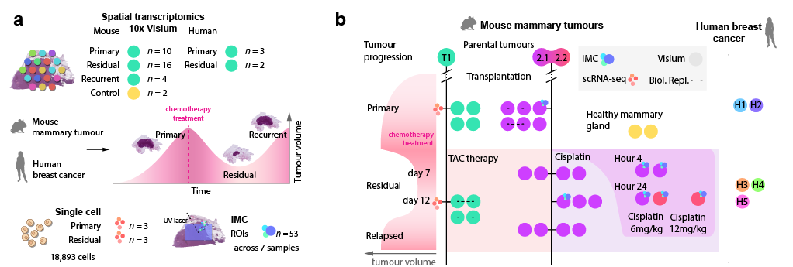

# Spatiotemporal organisation of residual disease in mouse and human BRCA1-deficient mammary tumours and breast cancer 

This repository contains scripts and notebooks used to analyse spatial transcriptomics, imaging mass cytometry, 
and single-cell RNA sequencing data presented in our research article. To rerun the analysis, you'll need to take some 
extra steps, such as getting the raw data, adjusting directory paths, and downloading raw and processed supplementary 
files from the Zenodo archives.

**Authors**: Demeter Túrós, Morgane Decollogny, Astrid Chanfon, Myriam Siffert, Lou Romanens, Jean-Christophe Tille, 
Intidhar Labidi-Galy, Alberto Valdeolivas, and Sven Rottenberg

**Abstract**: Breast cancer remains one of the prominent causes of death worldwide. Although chemotherapeutic agents 
often result in substantial reduction of primary or metastatic tumours, remaining drug-tolerant tumour cell 
populations, known as minimal residual disease (MRD), pose a significant risk of recurrence and therapy resistance. 
In this study, we describe the spatiotemporal organisation of therapy response and MRD in BRCA1;p53-deficient mouse 
mammary tumours and human clinical samples using a multimodal approach. By integrating single-cell RNA sequencing, 
spatial transcriptomics, and imaging mass cytometry across multiple treatment timepoints, we characterise dynamic 
interactions between tumour cell subpopulations and their surrounding microenvironment. Our analysis identifies a 
distinct, drug-tolerant epithelial-mesenchymal transition (EMT) cancer cell population, which exhibits a conserved 
expression program in human BRCA1-deficient tumours and significantly correlates with adverse clinical outcomes. We 
further reveal the spatial distribution of residual EMT-like tumour cells within specific anatomical niches, providing 
a framework for understanding the persistence of MRD and potential therapeutic vulnerabilities. These findings yield 
a comprehensive molecular roadmap of MRD, opening new avenues for therapeutic strategies targeting EMT-driven drug 
tolerance and tumour relapse.

<p align="center">
   
</p>

## Structure
```
.
├── imc
│   ├── spatialdata_imc
│   └── spatialdata_visium
│       └── functional_analysis
├── misc
├── single_cell
└── spatial_transcriptomics
    ├── human_data
    │   ├── dgea
    │   ├── emt_prolif_signatures
    │   ├── survival_analysis
    │   └── tumor_purity
    └── mouse_data
        ├── deconvolution_notebooks
        ├── dgea
        └── functional_analysis
```
## Contents

### `spatial_transcriptomics`
Contains scripts for spatial transcriptomics data analysis.

- `chrysalis_functions_update.py`: Updated functions for Chrysalis-based analysis.
- `functions.py`: General helper functions for spatial transcriptomics.
- `human_data/`: Analysis scripts for human spatial transcriptomics data.
- `mouse_data/`: Analysis scripts for mouse spatial transcriptomics data.

#### `human_data`

- `00_samplewise_qc.py`: Performs quality control for human samples.
- `01_preprocessing.py`: Preprocesses human spatial transcriptomics data.
- `02_cellular_niches.py`: Identifies cellular niches in human samples with Chrysalis.
- `03_functional_analysis.py`: Conducts functional enrichment analysis.
- `04_human_mouse_diffexp_comparison.py`: Compares differential expression between human and mouse samples.
- `05_human_mouse_cosine.py`: Computes cosine similarity between human and mouse signatures.
- `dgea/`: Scripts for differential gene expression analysis.
- `emt_prolif_signatures/`: Computes EMT and proliferation-related signatures in humans.
- `functions_human.py`: Utility functions for human data.
- `survival_analysis/`: Scripts for survival analysis.
- `tumor_purity/`: Scripts for estimating tumor purity with ESTIMATE.

#### `mouse_data`

- `00_samplewise_qc.py`: Performs quality control for mouse samples.
- `01_annotations_metadata.py`: Manages sample annotations and metadata.
- `02_cellular_niches.py`: Identifies cellular niches in mouse samples with Chrysalis.
- `03_cellular_niche_plots.py`: Generates visualizations for cellular niches.
- `04_cell_type_deconv.py`: Adds cell type deconvolution.
- `05_cell_type_deconv_plots.py`: Visualizes cell type deconvolution results.
- `06_cnv_inference.py`: Infers copy number variations.
- `07_compartment_morphology.py`: Visualizes spatial morphology of tissue compartments.
- `deconvolution_notebooks/`: Jupyter notebooks for cell type deconvolution.
- `dgea/`: Differential gene expression analysis scripts.
- `functional_analysis/`: Pathway enrichment and functional analysis scripts.
### `single_cell`
Contains scripts for processing and analyzing single-cell RNA sequencing data.

- `01_preprocessing.py`: Prepares single-cell data for downstream analysis.
- `02_integration.py`: Integrates datasets.
- `03_rna_velocity.py`: Computes RNA velocity to infer cell dynamics.
- `04_plots.py`: Generates visualizations for single-cell data.
- `05_diffexp.py`: Performs differential expression analysis.
- `functions.py`: General helper functions for single-cell analysis.
- `tilpred.R`: A script for predicting TIL (tumor-infiltrating lymphocyte) presence.


### `imc`
Contains scripts and functions for processing Imaging Mass Cytometry (IMC) data.

- `imc_functions.py`: General utility functions for IMC processing.
- `smd_functions.py`: Functions.
- `spatialdata_imc/`: Stepwise scripts for IMC spatial data processing, and visualization. 
- `spatialdata_visium/`: Scripts for integrating IMC with Visium spatial transcriptomics data.

### `misc`
Contains miscellaneous files.
